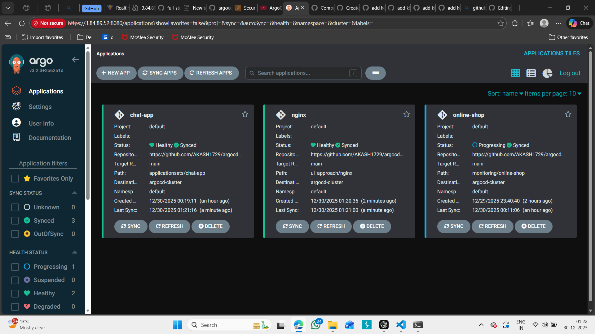
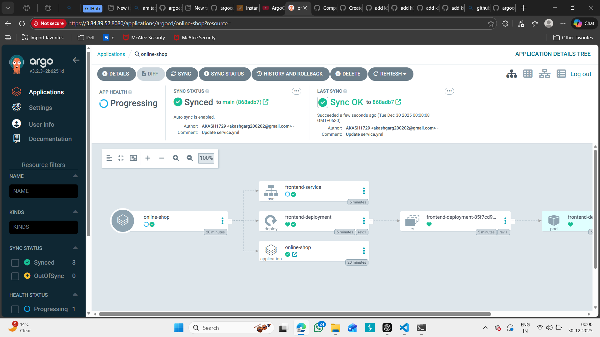
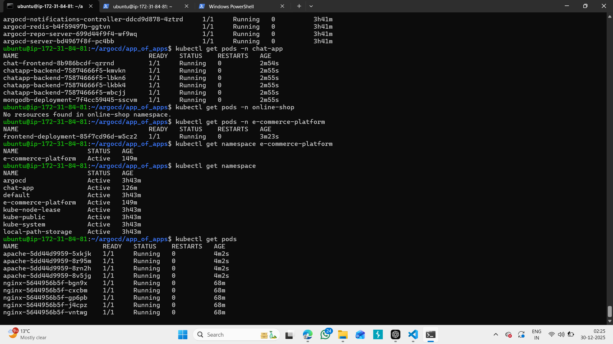

# CLI Approach with ArgoCD (Apache Example)

In this approach, we will deploy an application using the **ArgoCD CLI**.  
We’ll use a simple **Apache HTTPD Deployment + Service** to understand how ArgoCD can be controlled from the terminal.

---

## Theory

- In the **CLI approach**, we use the `argocd app create` command to define applications.  
- This command creates an `Application` resource (CRD) inside the cluster on our behalf.  
- The app definition lives **only in the cluster**, not in Git.  
- It’s fast and powerful for admins, but still **not true GitOps**, because changes are not version-controlled.  

> ⚠️ Important: The ArgoCD **Server** (installed in the cluster) must always be running.  
> The **CLI is only a client tool** that talks to the server’s API (just like `kubectl` talks to the Kubernetes API).  
> Without the server, the CLI cannot deploy or sync applications.  

> ✅ Best practice: Use the **Declarative approach (CRDs in Git)** for production.  
> ❌ The CLI method is best for operators or quick testing.  

---

## Prerequisites

Before you begin, ensure you have:  
1. A **Kind cluster** running  
2. **ArgoCD installed & running** (via Helm or manifests)  
3. **ArgoCD CLI installed**  
4. `kubectl` installed to interact with your cluster  

 

---

## Steps to Deploy Apache using ArgoCD CLI

### 1. Open a new VSCode editor & Open that `argocd` repo that you had clonned

Just for manifest files, or making changes or pushing it to git - used while testing all approaches.

In below directory you can see the related manifest files:

  ```bash
  cd argocd-demos/cli_approach/online-shop
  ````

---

### 📂 Directory Structure

```
cli_approach/online-shop
├── deployment.yml
└── service.yml
```

---

### 2. Login to ArgoCD (UI + CLI)

1. First, **login via ArgoCD UI** to make sure the server is running correctly.

   * Forward the argocd-server:

        ```bash
        kubectl port-forward svc/argocd-server -n argocd 8080:443 --address=0.0.0.0 &
        ```

   * Open: [http://\<instance\_public\_ip>:8080](http://<instance_public_ip>:8080)
   * Username: `admin`
   * Password: (fetched from secret)

2. Then, login to ArgoCD using CLI by replacing `<instance_public_ip>` and `<ADMIN_PASSWORD>` :

```bash
argocd login <instance_public_ip>:8080 \
  --username admin \
  --password <ADMIN_PASSWORD> \
  --insecure
```

Verify:

```bash
argocd account get-user-info
```

---

### 3. Add Your Cluster to ArgoCD (if not already added)

Check your config contexts:
```bash
kubectl config get-contexts
```

Identify your cluster context (e.g., `kind-argocd-cluster`).

Add the cluster to ArgoCD:

```bash
argocd cluster add kind-argocd-cluster --name argocd-cluster --insecure
```

Verify:

```bash
argocd cluster list
```

---

### 4. Create Application via CLI

Run this command to create an ArgoCD application:

```bash
argocd app create online-shop \
  --repo https://github.com/<your-username>/argo.git \
  --path cli_approach/online-shop \
  --dest-server https://<your_added_cluster_url> \
  --dest-namespace default \
  --sync-policy automated \
  --self-heal \
  --auto-prune
```

* Replace `<your-username>` with your GitHub username.
* Replace `<your_added_cluster_url>` with the cluster you registered (e.g., `https://172.31.xx.xx:port` or `https://kubernetes.default.svc`).


#### Explanation of Flags

  - --repo → Git repo with your manifests.
  - --path → Path in repo where manifests live (manifests/).
  - --dest-server → Target cluster (inside ArgoCD, e.g: https://kubernetes.default.svc = in-cluster).
  - --dest-namespace → Namespace to deploy (e.g., default).
  - --sync-policy automated → Auto-sync enabled.
  - --self-heal → Fix drift if someone changes/deletes resources manually.
  - --auto-prune → Remove resources if they’re deleted from Git.


Verify the app creation:

```bash
argocd app list
```

You should see `online-shop` in the list.

```
NAME               CLUSTER                      NAMESPACE  PROJECT  STATUS  HEALTH   SYNCPOLICY  CONDITIONS  REPO                                                PATH                 TARGET
argocd/apache-app  https://172.31.19.178:33893  default    default  Synced  Healthy  Auto-Prune  <none>      https://github.com/AKASH1729/argocd.git  cli_approach/apache 
```

and in UI, you can check it is creating:



---

### 5. Verify Application

Check app details:

```bash
argocd app get online-shop
```

Expected output: Shows repo, path, destination, sync status, and health.



---

### 6. Sync the Application

If the app shows **OutOfSync**, run:

```bash
argocd app sync online-shop
```


---

### 7. Verify Deployment in Kubernetes

From CLI:

```bash
kubectl get pods -n e-commerce-platform
kubectl get svc -n e-commerce-platform
```

You should see:

* online-shop pods running (`deployment-xxxx`).
* `online-shop-service` of type ClusterIP exposing port 80.



---

### 8. Access Apache via Browser

1. Port-forward the online-shop service:

```bash
kubectl port-forward svc/frontend-service 8083:80 --address=0.0.0.0 &
```

2. Open inbound rule for port `8083` on your EC2 instance.

3. Access the online-shop app at:

```
http://<EC2-Public-IP>:8082
```


---

## Testing

### Make a Change in Git

1. Open `deployment.yml`.
2. Change the replicas, e.g., `2 → 1`:

```yaml
spec:
  replicas: 1
```

3. Commit & push:

```bash
git add deployment.yml
git commit -m "Scale online-shop replicas  2 to 1"
git push origin main
```

### Observe in ArgoCD

```bash
argocd app get online-shop
```

* You’ll see the app go **OutOfSync**, then ArgoCD will sync automatically (because of `--sync-policy automated`).

Verify in Kubernetes:

Refresh the ArgoCD - online-shop using command:

```bash
argocd app get online-shop --hard-refresh
```

```bash
kubectl get pods -n e-commerce-platform
```

 Apache pods should be running.


---


> Tip: You can always run `argocd <command> --help` to see detailed usage and flags.

---

## Destroy 

For complete destroy, you can directly deleter the cluster by using below command:

```bash
kind delete cluster --name argocd-cluster
```

---

## Wrap-Up

* You successfully deployed an app via **ArgoCD CLI**.
* Key takeaway:

  * CLI is powerful for admins/operators.
  * It requires **ArgoCD server to be running** in the cluster.
  * Always login via **UI first → then CLI**.
  * Real GitOps requires **declarative Application CRDs in Git** (covered in the next approach).

Happy Learning!
